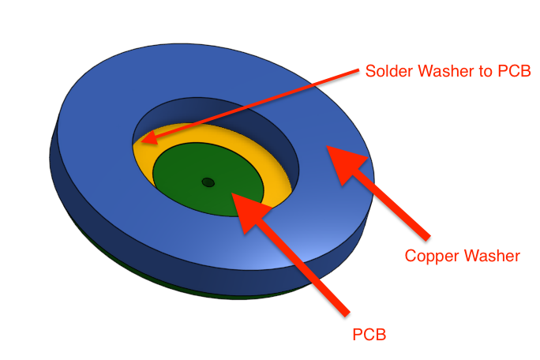

## Dummy CR2032 Battery PCB
### For use with bench top power supply. 

NOTE: This intended assembly is to use the PCB as the bottom layer and then solder on a copper washer (McMasterCarr 98044A232) to allow contact on the sides, where some battery tolders contact Bat+. See example assembly in onshape: https://cad.onshape.com/documents/6c6714f6692330e9ac4b6e11/w/1738f95351935be8d33ec7b4/e/a49d3b74e4a919522cef75a3

## Order PCBS From OshPark
https://oshpark.com/shared_projects/KR4qh0DY